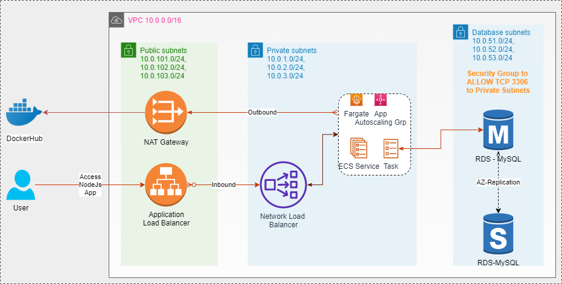
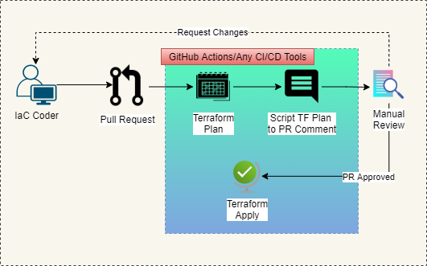
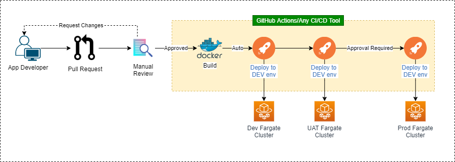
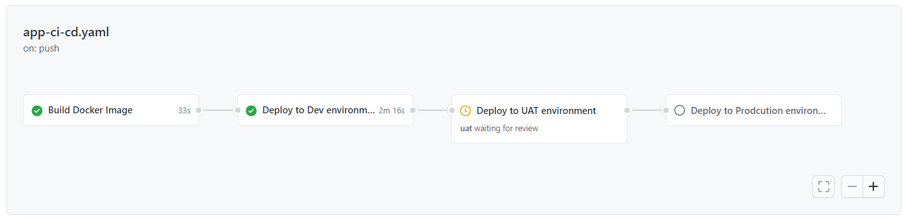

### Architecture Diagram:
Note: For my billing reasons, DockerHub free account is used instead of AWS ECR.

### DevOps Flow
 #### 1. Infrastructure (IaC with Terraform)
 Unlike application CI/CD flow, Terraform to have separate pipeline for each environment as each environment to go through the manual Plan review. With that said, following flow to be replicated for each environment.

 
 
 #### 2. Application
  CI/CD Flow for Application Deployment:
 
 
  Screenshot from GitHub Actions workflow
 
 
 ### Reason for choosing GitHub Action
1. Though it is newbie in the CI/CD tooling arena, community support to add and maintaining Actions are impressive due to it's popularity among OpenSource community
2. Better support on various events including Git Repos
3. Code base and CI/CD can be managed in a single platform
4. Does support common features such as codifying the CI/CD flow, trigger by events

### How to use this repository
**Challenge 1:** 
1. Fork the repo as the GitHub actions requires credentials for AWS and DockerHub
2. Update secret values for DOCKERHUB_TOKEN, DOCKERHUB_USERNAME, DOCKER_IMAGE_NAME at the repo level
3. Update secret values for AWS_DEFAULT_REGION (currently, it's hardcoded to Singapore in some places of the code, so set this value to ap-southeast-1 only), AWS_ACCESS_KEY_ID, AWS_SECRET_ACCESS_KEY at the environment level (dev, uat, prod)
4. Can manually trigger the GitHub Action workflow from the Actions tab in the following order,

	a. **Terraform Plan - Dev** to view Dev environment Plan, this workflow is configured to auto-trigger on a Pull Request to Main branch to generate the plan and script it in the comments for the manual review, once the PR is approved after the comments scripted by TF Plan action, the next workflow to apply the changes will be auto-triggered.

	b. **Terraform Apply - Dev** for Terraform Apply to provision the necessary resources including the Fargate Task and Service. After the successful completion of workflow, the NodeJs-MySQL app can be accessed with the provisioned Application Load Balancer public URL. This workflow will be auto-triggered on new commits in Main branch.

	c. UAT and PROD infrastructure can also be provisioned with respective Plan and Apply workflow. it is recommended to use different AWS Account for each environment.
	
	d. **CI/CD for Node.js CRUD App** to deploy new application changes to across environments. Triggering this flow will auto-deploy the new version in Dev environment and the same version can be promoted to UAT and PROD environment with approval. Make sure the necessary resources are provisioned for the UAT and PROD using the respective Terraform environment workflows.

**Challenge 2:**

Helm chart was created under ./Challenge2/charts/nginx-demo directory with Deployment  and supporting ingress and service templates.

    Cheers! 
	
